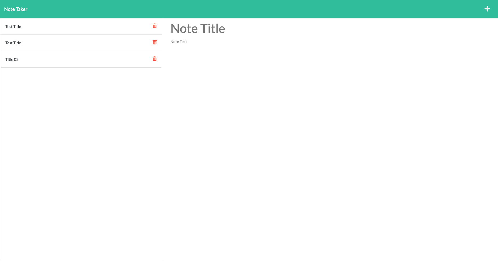

# Note Taker Web Application

## Description

Note Taker web application offers a streamlined and intuitive interface, empowering users to effortlessly create, save, and access their notes, making it an indispensable tool for personal and professional organization.

## Table of Contents

- [Installation](#installation)
- [Usage](#usage)
- [License](#license)
- [Technology Used](#technology-used)
- [Deployment](#deployment)
- [Author](#author)
- [Contributing](#contributing)
- [Questions](#questions)

## Installation

N/A

## Usage

The Note Taker app provides a convenient and intuitive platform for users to create, store, and organize their notes effectively. Users can easily access their notes from anywhere and quickly jot down new ideas or reminders. With a simple interface and seamless navigation, the app ensures a smooth note-taking experience, making it a valuable tool for daily tasks, brainstorming, and staying organized on the go.

## Technology Used

[JavaScript](!--https://developer.mozilla.org/en-US/docs/Web/JavaScript--)
[Node.js](!--https://nodejs.org--)
[Express.js](!--https://developer.mozilla.org/en-US/docs/Learn/Server-side/Express_Nodejs/Introduction--)
[Heroku](!--https://heroku.com--)

## Deployment

[Note-Taker](https://eg-note-taker-fd686ed98563.herokuapp.com/)

## Author

Elena Gurchinskaia

## Tests

N/A

## Contributing

N/A

## Questions

For any questions or inquires, feel free to reach out to me via GitHub:
[elenagurchinskaia](https://github.com/elenagurchinskaia) or Email: elenagurchinskaia@gmail.com.
